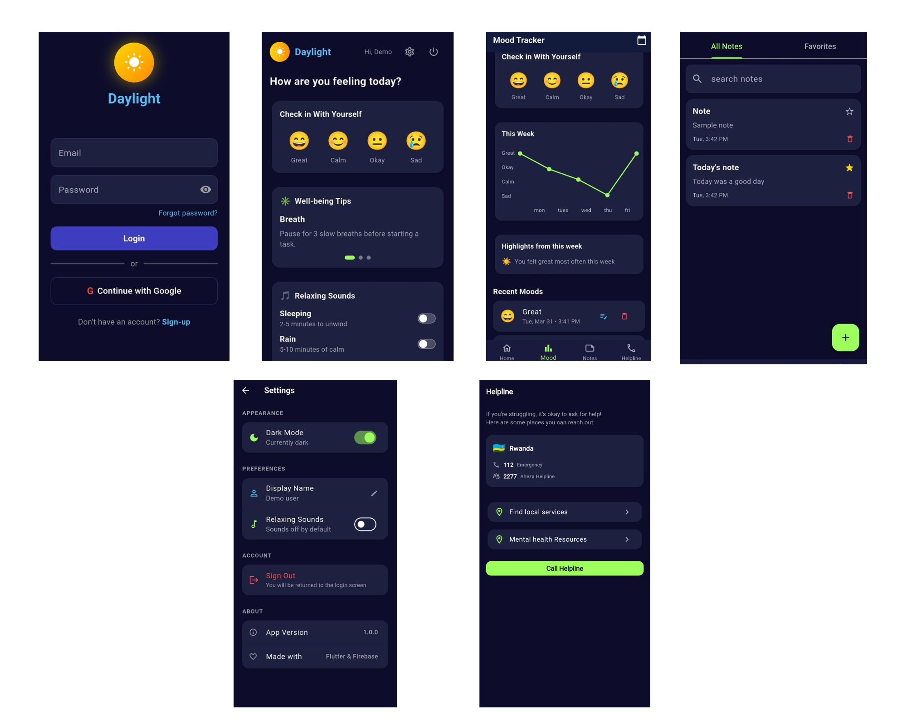
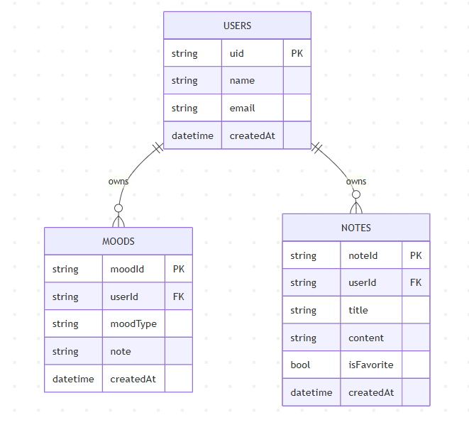

# Daylight 🌅

[](https://flutter.dev)
[](https://dart.dev)

**Daylight** is a cross-platform mental wellbeing companion app built with Flutter and Firebase. It helps users track mood, journal thoughts, access support contacts, and personalize their experience with theme and sound settings.

## Features

- **Authentication**: Secure login and registration with Firebase Auth.
- **Mood Tracking**: Log, view, edit, and delete daily moods with CRUD operations.
- **Journal/Notes**: Private notes for reflections and wellbeing journal.
- **Helpline Contacts**: Quick access to support helplines.
- **Home Dashboard**: Personalized overview of your wellbeing journey.
- **Settings**: Customize theme (light/dark mode).
- **Firebase-backed storage**: Built on Firebase Auth and Firestore.
- **Cross-Platform**: Android, iOS, Web, Desktop (Windows/macOS/Linux).

## Screenshots




## Project Structure

```
lib/
├── core/                 # Source code shared utilities
├── features/             # Feature-specific modules
├── android/, ios/, etc.  # Platform configs
├── pubspec.yaml          # Dependencies
├── test/                 # Tests
└── README.md             # Documentation
```

## Setup

### Prerequisites

- Flutter SDK 3.10+ installed
- Dart SDK included with Flutter
- Android/iOS/Desktop tooling for your target platform
- Optional: Firebase CLI (`flutterfire_cli`)

### Install dependencies

```bash
flutter pub get
```

### Configure Firebase

1. Install FlutterFire CLI:

   ```
   dart pub global activate flutterfire_cli
   ```

2. Run in project root:
   ```
   flutterfire configure
   ```
3. Confirm `lib/firebase_options.dart` is present.
4. Ensure your Firebase project includes Android/iOS/Web apps.

### Run the app

```bash
flutter run
```

### Run tests

```bash
flutter test
```

## Firebase Notes

The repository includes Firebase configuration in `lib/firebase_options.dart`. To point the app to a different Firebase project, run:

```bash
dart pub global activate flutterfire_cli
flutterfire configure
```

Then verify `lib/firebase_options.dart` is updated.

## Tech Stack

| Category                 | Technologies                                      |
| ------------------------ | ------------------------------------------------- |
| **Framework**            | Flutter (3.10+), Dart (3.x)                       |
| **State Management**     | flutter_bloc, equatable                           |
| **Architecture**         | Clean Architecture                                |
| **Backend/Storage**      | Firebase Auth, Cloud Firestore, SharedPreferences |
| **Dependency Injection** | get_it                                            |
| **Testing**              | flutter_test (unit/widget tests)                  |
| **Platforms**            | Android, iOS, Web, Linux, macOS, Windows          |

## Architecture

Daylight uses **Clean Architecture** with **BLoC pattern** for separation of concerns.

```
lib/
├── core/              # Shared utilities, theme, navigation, validators
├── features/
│   ├── auth/          # Login, register, password reset, verification
│   ├── home/          # Dashboard, wellbeing tips, sound playback
│   ├── mood/          # Mood tracking CRUD and charts
│   ├── notes/         # Notes CRUD, favorites, search
│   ├── helpline/      # Support contacts and resource links
│   └── settings/      # Preferences, theme, sound, logout
├── injection_container.dart  # Firebase dependency injection
├── firebase_options.dart     # Firebase project config
└── main.dart
```

Each feature follows: `data/` → `domain/` → `presentation/`

- **Domain Layer**: Pure business logic, entities, usecases.
- **Data Layer**: Repositories, remote/local datasources.
- **Presentation Layer**: BLoC/Cubit + UI.

Dependency Injection via `get_it`. State management: `flutter_bloc`.

## Firestore Schema

### Collections

- `users`
  - `uid`: string
  - `name`: string
  - `email`: string
  - `createdAt`: timestamp

- `moods`
  - `moodId`: string
  - `userId`: string
  - `moodType`: string
  - `note`: string
  - `createdAt`: timestamp

- `notes`
  - `noteId`: string
  - `userId`: string
  - `title`: string
  - `content`: string
  - `isFavorite`: bool
  - `createdAt`: timestamp

### Local settings

Stored via `SharedPreferences` in `SettingsCubit`:

- `isDarkMode`
- `displayName`
- `soundEnabled`

## Firebase Security Rules

The following Firestore rules in the console allow only authenticated, email-verified users to read and write their own records in `users`, `moods`, and `notes`.

```
rules_version = '2';
service cloud.firestore {
  match /databases/{database}/documents {

    function isAuthenticated() {
      return request.auth != null;
    }

    function isOwner(userId) {
      return request.auth.uid == userId;
    }

    match /users/{userId} {
      allow read, write: if isAuthenticated() && isOwner(userId);
    }

    match /moods/{moodId} {
      allow read, delete: if isAuthenticated()
        && isOwner(resource.data.userId);

      allow create: if isAuthenticated()
        && isOwner(request.resource.data.userId);

     }

    match /notes/{noteId} {
      allow read, delete: if isAuthenticated()
        && isOwner(resource.data.userId);

      allow create: if isAuthenticated()
        && isOwner(request.resource.data.userId);

      allow update: if isAuthenticated()
        && isOwner(resource.data.userId)
        // Prevent changing the owner of a note
        && request.resource.data.userId == resource.data.userId;
    }

    match /helplines/{helplineId} {
      allow read: if isAuthenticated();
      allow write: if false; // Only admins via Firebase console
    }
  }
}

```

## 🧠 ERD (Entity Relationship Diagram)



## Running Tests

```bash
flutter test
```

Includes unit tests (auth validators, mood usecases) and widget tests (login screen).

## Team

| Team Member | Role                                              |
| ----------- | ------------------------------------------------- |
| Solace      | All UI screens and widgets                        |
| Mahlet      | Domain layer (entities, repos, usecases) + BLoC   |
| Divine      | Firebase setup, Firestore repositories            |
| Olive       | BLoC integration, CRUD operations, error handling |
| Agertu      | Tests, documentation, demo preparation            |


